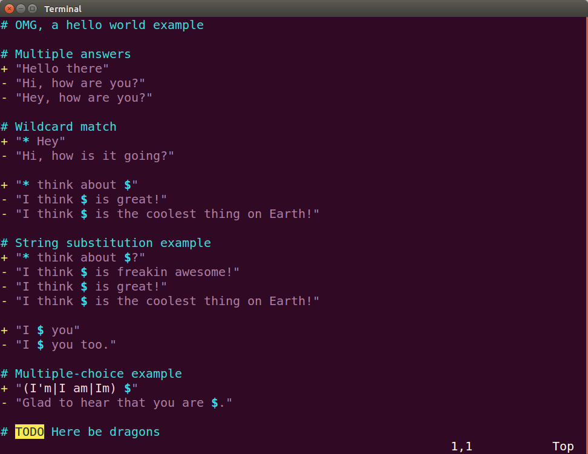

# Botlang support for vim

Adds syntax highlighting and snippets to [Botlang](https://botlang.org) files (`*.bot`, `*.botlang`) in vim.



## Usage

```sh
# Just clone this repository into your vim bundle directory and you are ready to go!
$ git clone git@github.com:botlang/vim-language-botlang.git ~/.vim/bundle/vim-language-botlang
```

Open a vim session with an exiting botlang source file and type `: set syntax on`, or create a new file and type `: set syntax=botlang`.

## Contributions

Contributions are greatly appreciated. Please fork this repository and open a pull request to add snippets, make grammar tweaks, etc.

## License

This distribution is covered by the **GNU GENERAL PUBLIC LICENSE**, Version 3, 29 June 2007.

## Support & Contact

Having trouble with this repository? Check out the documentation at the repository's site or contact m@matchilling.com and we’ll help you sort it out.

Happy Hacking

:v:
